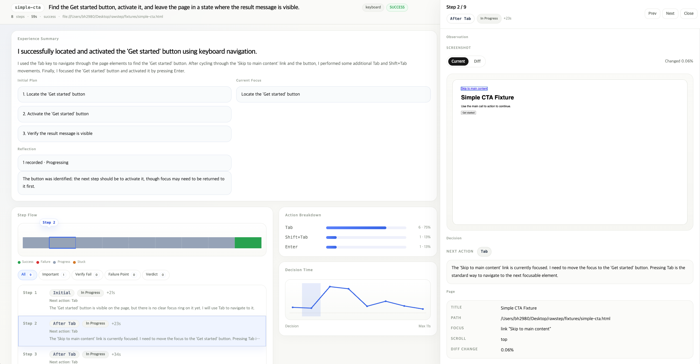

# RawStep

English | [한국어](./README.ko.md)

> An experimental runner for recording keyboard and screen reader task bottlenecks under limited observation

> [!WARNING]
> RawStep is not a stable accessibility diagnostic tool intended for real production use.
> It is a prototype for observing where an agent fails while attempting a task under a limited observation channel.
> At the moment, actual task success rates and reproducibility are low, and results can vary significantly depending on the model, backend, and environment state.

## Overview

Tools like axe-core and Lighthouse are good at finding DOM issues and rule violations.  
But they do not show very well where real users get stuck while trying to complete a task.

RawStep lets an agent attempt the task directly within a limited observation channel and a limited action set,
then records the process as traces and reports so you can review the bottleneck points afterward.

What RawStep is mainly meant to help you inspect:

- Whether it gets closer to the goal when moving like a keyboard user
- Whether a screen reader user could choose the next action using only the information that is actually read out
- How many steps it took before success or failure
- At which point it started wandering
- Whether success was actually confirmed by the verifier

| Item | Rule-based tools | RawStep |
|------|------------------|---------|
| Evaluation unit | Rule violations | Task completion |
| Input | DOM / ARIA | Screenshot or screen reader announcement |
| Output | Pass/fail by rule | Trace, metrics, prompts, HTML report |
| Bottleneck localization | Relatively weak | Experimental attempt to trace bottlenecks |
| Real user flow reproduction | Indirect | Direct attempt under limited conditions |

The table above is not meant as a performance ranking. It is closer to a simplified picture of the kind of experiment RawStep is trying to run.

## Better Fit For

- Experimenting with accessibility tasks through an agent
- Inspecting failure traces and bottleneck points more than success rates
- Exploring prompt, observer, verifier, and report structure
- Building an internal harness for idea validation

## Not Yet A Good Fit For

- Pass/fail decisions for real production accessibility quality
- Automation that replaces human testing
- Stable regression-testing infrastructure
- Highly reproducible operational diagnostics

## What You Get

Run output usually leaves the following files behind.

- `trace.jsonl`: replay log for each step
- `trace.json`: final merged trace
- `metrics.json`: total step count, exit reason, action count, timing
- `prompts.json`: prompts recorded per step
- `report/index.html`: human-readable report
- `diagnostics.jsonl`: created only when runtime warnings or errors exist

These artifacts are closer to records for reviewing the experiment process and failure points than to a final verdict document.

## Quick Start

```bash
pnpm install
cp .env.sample .env
# Fill in AI_PROVIDER, AI_API_KEY, and AI_MODEL in .env
# If you use an openai-compatible provider, also fill in AI_BASE_URL
pnpm rawstep run examples/tasks/simple-cta.json
```

The default output path is `./.rawstep/out/<mode>/<taskId>/<runId>/`.  
When the run finishes, the CLI prints the `report/index.html` path.

If you need provider-specific request options, put them in `rawstep.config.ts > defaults.providerOptions`.
For example, OpenAI-compatible reasoning settings now live under `providerOptions.openaiCompatible.*` instead of a dedicated `reasoningEffort` top-level field.

This repo already includes a working default [rawstep.config.ts](./rawstep.config.ts).  
At the beginning, it is easier to fill in `.env` and run the example tasks under `examples/tasks/` instead of creating a new config file from scratch.

This example is mainly for checking the basic flow.  
Even if it runs, that does not mean it can perform real-site tasks reliably.

## Execution Models

### `keyboard`

- Observation: current viewport screenshot, previous screenshot, focus hint, scroll hint
- Actions: allowed keys such as `Tab`, `Shift+Tab`, arrows, `Enter`, `Space`, `Escape`, `Home`, `End`
- Note: requires a model that can accept image input

### `screenreader`

- Observation: announcement text, capture method, observe reason, readbacks
- Actions: allowed screen reader actions such as `sr.next`, `sr.form.next`, `sr.heading.next`, `sr.act`, `sr.key.*`
- Note: developer screenshots may be saved, but they are not included in agent input

### Information Hidden from the Agent

- DOM selectors
- Accessibility tree
- Full ARIA role/label information
- Ground-truth answers about whether an element exists
- Precise visual location data

## Task Example

A task file is the execution unit that says what should be done on which page.

```json
{
  "url": "../../fixtures/simple-cta.html",
  "goal": "Find and activate the Get started button, then leave the page in a state where the result message is visible.",
  "verify": {
    "all": [
      { "textVisible": "Started!" },
      { "titleIncludes": "Completed" }
    ]
  }
}
```

Common additional fields are listed below.

- `id`
- `mode`
- `maxSteps`
- `timeoutMs`
- `input`
- `prompt`
- `config`
- `verify`

See [docs/task.md](./docs/task.md) for the full spec.

## What You Can Inspect In The Report

The report usually organizes the following information.

- Final success/failure
- Failure point
- Action breakdown
- Timing overview
- Step detail
- Screen reader announcement evidence
- Experience summary
- Planning / reflection results

See [docs/report.md](./docs/report.md) for the report structure in detail.

### Report Preview



## Detailed Docs

- [docs/task.md](./docs/task.md): task spec, `input`, `verify`, override rules
- [docs/config.md](./docs/config.md): `rawstep.config.ts`, defaults, modes, planning, observe, precedence
- [docs/cli.md](./docs/cli.md): CLI options, provider environment variables, allowed keys/actions
- [docs/report.md](./docs/report.md): report structure and section descriptions
- [docs/prompts.md](./docs/prompts.md): prompt file structure and template variables
- [docs/editing-map.md](./docs/editing-map.md): editing entry points and post-change checks

## Current Limits

- This project is still in the prototype stage.
- Actual task success rates are low, and even the same task can produce different results from run to run.
- The agent only receives limited observation channels, so it does not know the full context the way a real user might.
- `screenreader` mode is heavily affected by backend quality and environment state.
- In the `screenreader + guidepup-voiceover` combination, a synthetic announcement may be used after `typeText`.
- Free-form text generation for inputs is not allowed. The agent can only input values that the task provides.
- It is still too unstable to use as a definitive pass/fail judgment tool for real accessibility quality.

## License

This project is licensed under the MIT License.  
See [LICENSE](./LICENSE) for the full text.
